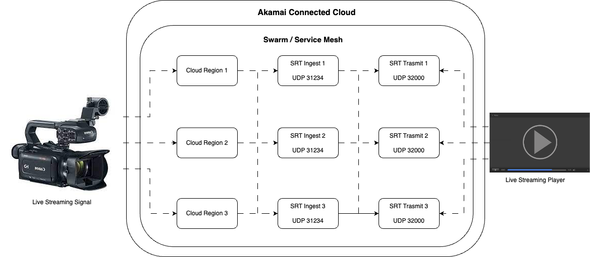

Getting Started
---------------

### Introduction

---
This is a demo project for education/training purposes of streaming.

It automates (using **Terraform**) the provisioning of the following infrastructure for live streaming in Akamai 
Connected Cloud (former Linode) using the [**SRT**](https://www.haivision.com/products/srt-secure-reliable-transport/) 
protocol designed by [**Haivision**](https://www.haivision.com/):
- **Compute Instances**: Where the live streaming server will be running.
- **Cloud Firewall**:  Protects the streaming traffic.

Please check the files `linode.tf`, `linode-instances.tf`, `linode-firewall.tf`, `linode-ssh-keys.tf` for more details.

### Workflow

---
The idea is to have multiple locations to receive/transmit a live streaming signal with high availability using the 
concept of swarm and service mesh.

You can have as much nodes as you need, and ingest/transmit multiple signals (in different UDP ports). To customize 
your infrastructure, please edit the files `settings.json` and `stack.yml` to specify the live streaming signals, 
regions, number of nodes, allowed ips for ingestion and more.

### Requirements

---
To build the mentioned workflow, you will need to install the following software:

- [**Docker**](https://www.docker.com): Container platform to run the SRT server.
- [**Terraform 1.5.x**](https://www.terraform.io): Very famous IaC tool, used for the provisioning of the resources.

### Documentation

---
Follow the documentation below to know more about Akamai:

- [**How to create Akamai Connected Cloud credentials**](https://www.linode.com/docs/api)
- [**Getting Started with Compute Instances**](https://www.linode.com/docs/products/compute/compute-instances/)
- [**List of Akamai Connected Cloud Regions**](https://www.linode.com/docs/api/regions/)
- [**List of Compute Types**](https://www.linode.com/docs/api/linode-types/)
- [**List of Compute Images**](https://www.linode.com/docs/api/images/)
- [**Getting Started with Cloud Firewalls**](https://www.linode.com/docs/products/networking/cloud-firewall/get-started/)
- [**Linode documentation**](https://www.linode.com/docs/)

### Important notes

---
- **DON'T EXPOSE OR COMMIT ANY SENSITIVE DATA, SUCH AS CREDENTIALS, IN THE PROJECT.**

### Contact

---
**LinkedIn:**
- https://www.linkedin.com/in/fvilarinho

**e-Mail:**
- fvilarin@akamai.com
- fvilarinho@gmail.com
- fvilarinho@outlook.com
- me@vila.net.br
